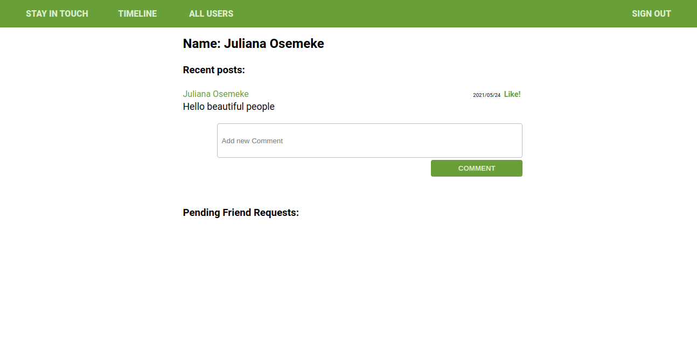

# Stay In Touch Social Media App


 

> This collaborative project entails building upon an already existing social media project with improvised features
These features are enumerated below.

### As a guest user:

- I want to be able to create account/log in.
- I can see only “Sign in” and “Sign out” page.

### As a logged-in user:
- I want to be able to see all users list.
- I want to be able to see selected user page with their user name and all posts written by them (the most recent posts on the top).
- I want to be able to send a friendship invitation.
- I want to see a button “Invite to friendship” next to the name of user who is not my friend yet - on both users’ list and single user page.
- I want to be able to see pending friendship invitations sent to me from other users.
- I want to be able to accept or reject friendships invitation.
- I want to be able to create new posts (text only).
- I want to be able to like/dislike posts (but I can like single post only once).
- I want to be able to add comments to posts.
- I want to be able to see “Timeline” page with posts (with number of likes and comments) written by me and all my friends (the most recent posts on the top).
- Timeline page should be the root page of the app.


## Built With

- Ruby v2.7.2
- Ruby on Rails v5.2.4

## Live Demo

[Live Site](https://calm-woodland-30958.herokuapp.com/)


## Getting started

To get started with the app, first clone the repo and `cd` into the directory:

```
$ git clone https://github.com/JulianaOsemeke/ror-social-scaffold.git
$ cd ROR-SOCIAL-SCAFFOLD
```

Then install the needed packages (while skipping any Ruby gems needed only in production):

```
$ bundle install
```

Next, migrate the database:

```
$ rails db:migrate
```

### Prerequisites

Ruby: 2.6.3
Rails: 5.2.3
Postgres: >=9.5

### Setup

Instal gems with:

```
bundle install
```

Setup database with:

```
   rails db:create
   rails db:migrate
```

### Github Actions

To make sure the linters' checks using Github Actions work properly, you should follow the next steps:

1. On your recently forked repo, enable the GitHub Actions in the Actions tab.
2. Create the `feature/branch` and push.
3. Start working on your milestone as usual.
4. Open a PR from the `feature/branch` when your work is done.


### Usage

Start server with:

```
    rails server
```

Open `http://localhost:3000/` in your browser.

### Running RSpec tests

- `cd` into the project directory;
- Run `bundle exec rspec`. 


### Deployment
- To deploy locally after cloning
- Run "rails server" in terminal
- open https://localhost:3000 in browser
- sign up and enjoy

## Authors

**Stephanie Sakuhuni**

- GitHub: [@stephanie041996](https://github.com/Stephanie041996)
- LinkedIn: [Stephanie Sakuhuni](www.linkedin.com/in/stephanie-michelle-sakuhuni) 

**Juliana Osemeke**
- GitHub: [@githubhandle](https://github.com/JulianaOsemeke)
- LinkedIn: [LinkedIn](https://www.linkedin.com/in/juliana-osemeke/)

## 🤝 Contributing

Contributions, issues and feature requests are welcome!

Feel free to check the [issues page](issues/).

## Show your support

Give a ⭐️ if you like this project!

## Acknowledgments

TBA

## 📝 License

MIT

